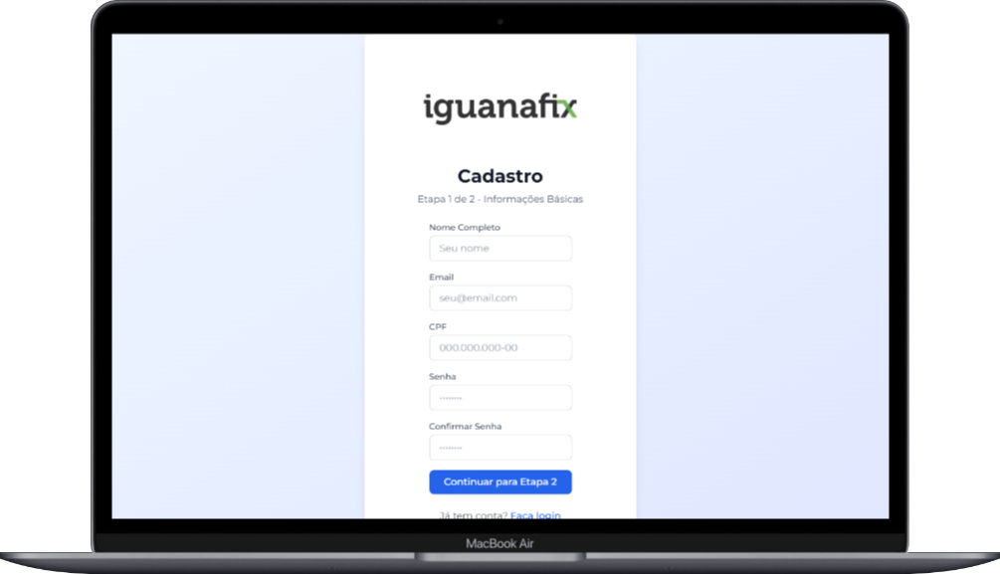

## 🎨 Projeto Front-end ChatBot Inteligente IguanafiX


É uma aplicação frontend desenvolvida em Next.js para um **ChatBot Inteligente** para orientação dos prestadores de serviço. A plataforma permite que usuários se **cadastrem**, façam **login** e interajam com um **chatbot inteligente** para completar o processo de registro. O projeto inclui funcionalidades de **autenticação**, **dashboard** e **assistência virtual**.

## 🚨 Problematização

O processo atual de cadastro de prestadores na IguanaFix, apesar de ser funcional, apresenta desafios significativos. O fluxo de inscrição é extenso e demorado, o que leva muitos profissionais a desistirem antes de concluir o cadastro. Além disso, a experiência não é otimizada para garantir uma navegação fluida e eficiente. 

## 💡 Solução Encontrada
O objetivo principal é permitir que novos prestadores se cadastrem na plataforma de forma simples e intuitiva. O processo de cadastro é dividido em etapas, começando com informações básicas e prosseguindo para uma interação mais detalhada, com um assistente virtual (chatbot).

## 🧰 Tecnologias Utilizadas 

Essas tecnologias foram escolhidas para criar uma aplicação moderna, escalável e com boa experiência de desenvolvimento, focando em tipagem forte, performance e usabilidade.

| Tecnologias | Versão | Descrição |
|-------------|--------|-----------|
| Next.js     | v14.0.0 | Framework React para aplicações web. |         
| React       | v18.2.0 | Biblioteca JavaScript para construção de interfaces de usuário, focada em componentes reutilizáveis e gerenciamento de estado.
| TypeScript  | v5.3.3 | Tipagem estática para JavaScript. |
| Tailwind Css | v3.3.6 | Framework CSS utilitário para estilização. |
| Zod | v4.1.12 | Validação de esquemas de dados. |
| Axios | v1.6.2 | Cliente HTTP para requisições API. |
| Node.js | v22.15.0 | Essencial para executar o Next.js, gerenciar dependências via npm e rodar scripts de build e desenvolvimento. |
| PostCss | v8.4.32 | Ferramenta para transformação de CSS, usada em conjunto com plugins como Autoprefixer para compatibilidade entre navegadores. |
| Git | v2.46.0 | Versionamento das versões do projeto |

## ⚙ Principais Funcionalidades

- **Página Inicial**: Apresentação da plataforma com links para cadastro e login.
- **Cadastro e Login**: Formulários para registro e autenticação de prestadores.
- **Chatbot Inteligente**: Assistente virtual que guia o usuário através do processo de onboarding, coletando informações essenciais.
- **Dashboard**: Área pessoal do usuário com estatísticas de perfil, documentos e serviços.

## 📂 Estrutura de Pastas

```
Frontendprivate/
├── next-env.d.ts              # Tipos do Next.js
├── next.config.js             # Configuração do Next.js
├── package.json               # Dependências e scripts do projeto principal
├── postcss.config.js          # Configuração do PostCSS
├── README.md                  # Documentação básica
├── tailwind.config.js         # Configuração do Tailwind CSS
├── tsconfig.json              # Configuração do TypeScript
├── public/                    # Arquivos estáticos públicos
├── shared/                    # Pacote compartilhado
│   ├── index.ts               # Exportações principais
│   ├── package.json           # Dependências do pacote compartilhado
│   ├── schemas.ts             # Esquemas de validação Zod
│   ├── tsconfig.json          # Configuração TS para shared
│   └── types.ts               # Tipos TypeScript compartilhados
└── src/                       # Código fonte da aplicação
    ├── app/                   # Páginas e layout (App Router)
    │   ├── globals.css        # Estilos globais
    │   ├── layout.tsx         # Layout raiz da aplicação
    │   ├── page.tsx           # Página inicial
    │   ├── chatbot/           # Página do chatbot
    │   │   └── VirtualAssistant.tsx
    │   ├── dashboard/         # Página do dashboard
    │   │   └── page.tsx
    │   ├── login/             # Página de login
    │   │   └── page.tsx
    │   └── register/          # Página de registro
    │       └── page.tsx
    ├── components/            # Componentes reutilizáveis
    │   ├── ChatBot.tsx        # Componente principal do chatbot
    │   ├── ChatBotOnboarding.tsx # Onboarding do chatbot
    │   └── LogoIguanafix.tsx  # Componente do logo
    └── services/              # Serviços e APIs
        └── api.ts             # Configuração e serviços da API
```
## 📌 Páginas da Plataforma
- **Página Inicial** ```page.tsx```: Landing page com apresentação da plataforma e links para cadastro/login.
- **Login** ```page.tsx```: Formulário de autenticação.
- **Registro** ```page.tsx```: Formulário de cadastro de novos prestadores.
- **Dashboard** ```page.tsx```: Área pessoal com estatísticas e assistente virtual.
- **Chatbot** ```chatbot/VirtualAssistant.tsx```: Página dedicada ao assistente virtual.

## 🔗 Serviços de API
O projeto utiliza Axios para comunicação com o backend. Os principais serviços incluem:

### authService:

- ```register:``` Cadastro de novos usuários
- ```login:``` Autenticação de usuários
- ```getMe:``` Obtenção de dados do usuário

### chatbotService:

- ```chat:``` Interação com o chatbot

### providersService:

- ```getAll:``` Listagem de todos os prestadores
- ```getById:``` Obtenção de dados de um prestador específico

## 💾 Arquivos de Configuração

- ```next.config.js:``` Configurações específicas do Next.js
- ```tailwind.config.js:``` Configuração do Tailwind CSS
- ```postcss.config.js:``` Configuração do PostCSS
- ```tsconfig.json:``` Configurações do TypeScript para o projeto principal
- ```tsconfig.json:``` Configurações do TypeScript para o pacote compartilhado

## ✅ Scripts Disponiveis

- ```npm run dev:``` Inicia o servidor de desenvolvimento
- ```npm run build:``` Compila a aplicação para produção
- ```npm run start:``` Inicia o servidor de produção
- ```npm run lint:``` Executa o linter ESLint
- ```npm run type-check:``` Verifica tipos TypeScript

## 📸 Imagens do Projeto


###



## 📝 Pré-requisitos
Para utlizar essa aplicação com o funcionanmento esperado é necessario baixar alguns requesitos primeiro.

- [Nodejs](https://nodejs.org/pt/download) Versão 18+
- [Git](https://git-scm.com/install/windows) Versão 2.46+

## 🎯 Variáveis de Ambiente
```
NEXT_PUBLIC_API_URL=https://kw4d0mgz-3001.brs.devtunnels.ms/
```

## ✅ Passo a Passo para Instalação
- 1 - Primeiro você vai precisar clonar o projeto no repositorio com esse codigo na sua máquina.
```
git clone https://github.com/HackathonPdA2025-Squad2/backendprivate.git.
```

- 2 - Entre na pasta do projeto
```
cd Frontendprivate/
```

- 3 - Instale todas as dependencias da aplicação no Terminal
```
npm Install
```

- 4 - Para rodar a aplicação em desenvolvimento
```
npm run dev
```

## 👥 Squad de Desenvolvimento 02 Hackathon 2025

| Nome             | Função              |
|------------------|---------------------|
| [Grazielle Nascimento Ferreira](https://github.com/GrazielleNascimento) | Colaborador/a |
| [Ingrid Oliveira](https://github.com/iingridliveira)        | Colaborador/a |
| [Samuel Ribeiro](https://github.com/Samuel-Kepler) | Líder     |
| [Jerônimo S. Rodrigues](https://github.com/JeronimoSantos)    | Colaborador/a |
| [Débora](https://www.linkedin.com/in/debora-vitoria) | Colaborador/a |


## Lincença 

Este projeto está licenciado sob a Licença MIT - veja o arquivo [LICENSE](LICENSE) para mais detalhes .
